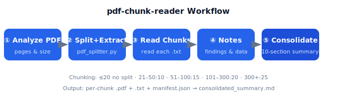

# pdf-chunk-reader

Let AI read hundred-page literature the way a human does — automatically split an unreadable large PDF into chunks, read each chunk, and consolidate a structured summary. A **framework-agnostic, cross-agent** AI literature-reading skill. Just one pure-Python script plus a workflow doc; any agent that can run commands and read files (WorkBuddy, CodeBuddy, Claude Code, Codex, Cursor, Cline, Aider, …) can use it directly.

[](LICENSE)
[](https://github.com/Z-exile/pdf-chunk-reader)
[](https://github.com/Z-exile/pdf-chunk-reader/stargazers)

> When the Read tool truncates, drops pages, or loses figures on a large PDF, pdf-chunk-reader splits the document into small pieces, lets the AI read them one by one, then merges them into a complete note with a data table.



## Why you need it

Three pain points of AI reading large PDFs:

- **Context truncation**: long documents exceed a single read limit and the tail is lost.
- **Missing middle pages**: chunked reading easily skips or misorders pages.
- **Figure/table extraction failure**: scanned pages, complex layouts, and in-figure text are hard to capture.

The traditional workaround is manual slicing, copy-paste loops, and fragmented info. pdf-chunk-reader automates the whole "split → read chunk-by-chunk → structured consolidation" pipeline into one command, producing reusable knowledge notes.

## Features

- **Automatic chunking**: picks pages-per-chunk by document size (≤20 no split; 21–50:10; 51–100:15; 101–300:20; 300+:25), or set manually.
- **PDF + text dual output**: each chunk yields both `.pdf` and `.txt`; read text to save tokens, fall back to the PDF chunk for figures/tables.
- **Reading protocol**: `manifest.json` holds the chunk list and a reading SOP, guaranteeing no skipped or misordered chunks.
- **Structured consolidation template**: a built-in 10-section summary (bibliography → question → method → results → mechanism → performance table → conclusion → project relevance → figure index → citations).
- **Plug-and-play / cross-platform**: install as a "skill" or "command" in any agent (see Quick Start); auto-triggers on large PDFs, or invoke manually.
- **Zero privacy dependency**: pure local script, no network, no upload — safe for confidential documents.

## Use cases / potential

This skill is not just for "reading papers" — any scenario where "the AI can't read a long PDF in full" fits:

1. **Academic literature deep-reading**: chapter-by-chapter breakdown of theses, long reviews, conference proceedings.
2. **Patent & technical report parsing**: batch-split patents, extract claims, embodiments, and prior-art highlights.
3. **Competitor / standard research**: chunk standards and competitor whitepapers, build comparison matrices.
4. **Textbook & manual knowledge extraction**: turn manuals and equipment docs into structured knowledge bases.
5. **Legal / contract long documents**: distill clauses, obligations, and risks without missing key pages.
6. **Expert agent's "external memory"**: cache read literature into a `fulltext/` library for later retrieval and cross-reference.
7. **Any long-document "read-and-summarize"**: research reports, policy docs, technical due-diligence — one-click reusable notes.

Especially valuable for research/engineering expert agents: feed a hundred-page review to the expert, it reads it all, consolidates, and writes into its own knowledge base — an "external literature memory" for the agent.

## Cross-agent portability

This skill is **framework-free**: the core is a pure-Python script (only depends on `pypdf`) plus a Markdown workflow (`SKILL.md`). Any agent meeting these two conditions can use it directly:

- Can run shell commands / Python (`pdf_splitter.py` does splitting and text extraction);
- Can read local files (reads each `txt` / `pdf` chunk, then writes `consolidated_summary.md`).

So it works not only with WorkBuddy / CodeBuddy, but also Claude Code, Codex, Cursor, Cline, Aider, and any custom LLM workflow. Install per platform in Quick Start.

## Quick Start

### Common prerequisite

```bash
pip install pypdf
```

This repo is a **self-contained package**: one Python script `scripts/pdf_splitter.py` + one workflow doc `SKILL.md`, **with no dependence on any agent framework**. Drop it into your agent's "skills / commands / instructions" load location:

| Agent | Install location |
|-------|------------------|
| WorkBuddy / CodeBuddy | `~/.workbuddy/skills/pdf-chunk-reader/` |
| Claude Code | `~/.claude/skills/pdf-chunk-reader/` (reads SKILL.md directly) |
| Codex | Merge SKILL.md into `codex.md` / `AGENTS.md`, or let Codex read and run the script per the workflow |
| Cursor / Cline / Aider / others | Let the agent read `SKILL.md`; run `scripts/pdf_splitter.py` when needed |
| Pure CLI | No install; just `python scripts/pdf_splitter.py ...` |

```bash
# e.g. clone into WorkBuddy user-level skills dir
# Windows
git clone https://github.com/Z-exile/pdf-chunk-reader.git "%USERPROFILE%\.workbuddy\skills\pdf-chunk-reader"
# macOS / Linux
git clone https://github.com/Z-exile/pdf-chunk-reader.git ~/.workbuddy/skills/pdf-chunk-reader
```

In agents that support auto-trigger, refresh/restart to activate; other agents can just say "read this large PDF" in chat.

### Use the script standalone

```bash
pip install pypdf
python scripts/pdf_splitter.py "path/to/big_paper.pdf" --output-dir "./out"
```

## Usage

### In any agent

Tell the AI: "Read this large PDF: `<path>`", or have it follow the `SKILL.md` workflow. When a file is >15 pages or >5MB the skill auto-triggers the split-read-consolidate pipeline (in auto-trigger-capable agents).

### Command line

```bash
# Show PDF info (pages / size / metadata) only, no split
python scripts/pdf_splitter.py "paper.pdf" --info-only

# Default split + text extraction (output to ./_split_<filename>/)
python scripts/pdf_splitter.py "paper.pdf"

# Custom output dir and chunk size
python scripts/pdf_splitter.py "thesis.pdf" --output-dir "./chunks" --pages-per-chunk 25
```

After running:

1. Read `manifest.json` for the chunk layout;
2. Read each `chunk_NNN_*.txt` in order (use `offset/limit` if a file is huge);
3. For figures/tables, read the corresponding `chunk_NNN_*.pdf`;
4. Consolidate into `consolidated_summary.md` using the built-in 10-section template.

### Example session

```text
$ python scripts/pdf_splitter.py "Deep_Learning_Survey_2025.pdf" --info-only
  Pages: 142 | Size: 38.4 MB | Title: A Comprehensive Survey on Efficient LLMs
  → exceeds 15 pages / 5 MB → auto-split recommended

$ python scripts/pdf_splitter.py "Deep_Learning_Survey_2025.pdf" --output-dir ./chunks
  Created 8 chunks (pages-per-chunk = 20):
    chunk_001_pp001-020.pdf  +  chunk_001_pp001-020.txt
    chunk_002_pp021-040.pdf  +  chunk_002_pp021-040.txt
    ...
    chunk_008_pp141-142.pdf  +  chunk_008_pp141-142.txt
  manifest.json written (8 chunks, reading SOP included)

# Agent reads each chunk_NNN_*.txt in order, then writes:
$ cat consolidated_summary.md | head -20
  # Consolidated Summary — A Comprehensive Survey on Efficient LLMs
  ## 1. Bibliographic info
     Authors: X. Lee et al. | Year: 2025 | Venue: arXiv:2503.xxxxx
  ## 2. Research question
     How to cut LLM inference cost without sacrificing accuracy?
  ## 3. Method
     Surveys 6 families: quantization, pruning, distillation, MoE, ...
  ## 6. Performance data (excerpt)
     | Method        | Bits | Accuracy↓ | Speed↑ |
     |---------------|------|-----------|--------|
     | FP16 baseline | 16   | –         | 1.0×   |
     | INT4 (GPTQ)   | 4    | -0.8%     | 3.1×   |
  ...
```

The chunked reads never exceed a single-Read limit, so nothing is truncated; the 10-section template guarantees the same structure across every paper.

## How it works

```
Large PDF → [1. Analyze] → [2. Split by page] → [3. Read chunk-by-chunk] → [4. Structured note extraction] → [5. Consolidate] → Unified summary
```

Chunking strategy:

| Total pages | Pages per chunk |
|-------------|----------------|
| ≤20 | no split (single block) |
| 21–50 | 10 |
| 51–100 | 15 |
| 101–300 | 20 |
| 300+ | 25 |

Consolidation template (10 sections):

1. Bibliographic info
2. Research question & hypothesis
3. Experimental method
4. Key results (with units and page numbers)
5. Microstructure & mechanism analysis
6. Performance data table
7. Conclusions & implications
8. Relevance to your project / domain
9. Figures & tables index
10. Citations worth tracking

## Integrating with expert / agent systems

This skill can be invoked by any research/domain expert agent: when the expert receives a large PDF, it first runs the split-read pipeline, then fills the domain-specific sections of the consolidation template with its own expertise, cross-references its existing literature library, and caches the summary into `references/fulltext/` for reuse.

## Directory structure

```
pdf-chunk-reader/
├── SKILL.md              # Skill documentation & workflow (read by any agent)
├── scripts/
│   └── pdf_splitter.py   # Split + text extraction + manifest generation
├── assets/
│   └── workflow.svg      # Workflow diagram (rendered on the README)
├── README.md
├── CONTRIBUTING.md       # How to contribute
├── SECURITY.md           # Vulnerability reporting & privacy notes
├── LICENSE
└── .gitignore
```

## FAQ

**Q: Can it read scanned / image-only PDFs?**
A: Text extraction relies on pypdf and may be incomplete for scanned pages. In that case read the chunk PDF directly (the Read tool handles figure/table visualization).

**Q: Does splitting create many temp files?**
A: It generates chunk `.pdf` / `.txt` files and `manifest.json` in the output dir. After consolidation you can delete them, keeping only `consolidated_summary.md`.

**Q: How large a PDF is supported?**
A: For 100+ page theses, prefer `--pages-per-chunk 25` and read only relevant sections via the table of contents.

## Roadmap

- [ ] Chunk by "section / bookmark" instead of by page only
- [ ] Multi-language OCR fallback (scanned pages)
- [ ] Auto-write consolidated summary into Obsidian / knowledge base
- [ ] Integration examples for more agent frameworks (LangChain / AutoGen)

## Contributing

Issues and pull requests are welcome! Please read [CONTRIBUTING.md](CONTRIBUTING.md) for the dev setup, branch/PR conventions, and coding style before opening a PR.

Quick local dev:

```bash
pip install pypdf
python scripts/pdf_splitter.py --help
```

## Security

This skill runs **100% locally** — it never uploads your PDFs or notes to any server. To report a vulnerability, see [SECURITY.md](SECURITY.md).

## License

MIT — see [LICENSE](LICENSE).
